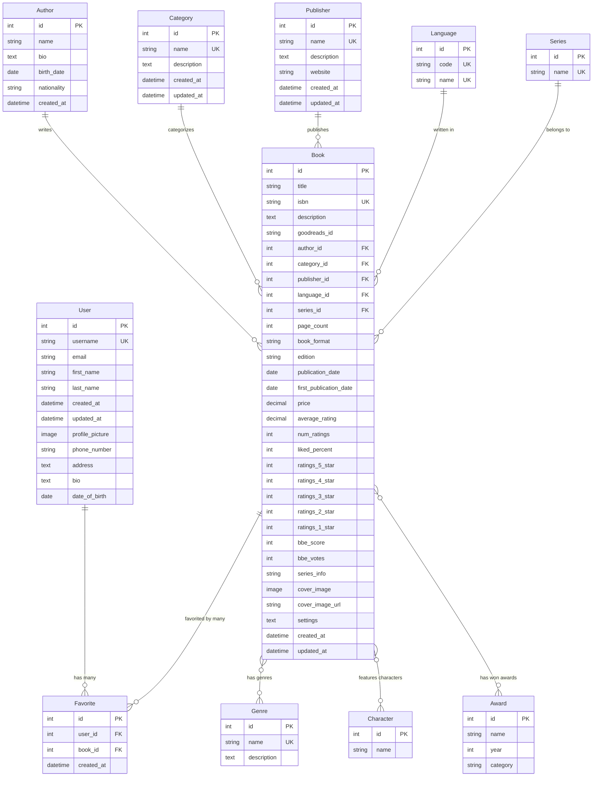

# Database Schema Documentation

This document provides a comprehensive overview of the Django Bookstore database schema, including Entity Relationship (ER) diagrams and detailed model descriptions.

## 🗄️ Entity Relationship Diagram

### Visual ER Diagram


### Interactive Mermaid Diagram


## 📊 Model Descriptions

### Core Models

#### User Model
- **Purpose**: Custom user model extending Django's AbstractUser
- **Key Fields**: username, email, profile information
- **Relationships**: One-to-many with Favorite
- **Features**: Profile pictures, contact information, bio

#### Book Model
- **Purpose**: Central model storing all book information
- **Key Fields**: title, ISBN, description, pricing, ratings
- **Relationships**: 
  - Many-to-one with Author, Category, Publisher, Language, Series
  - Many-to-many with Genre, Character, Award
  - One-to-many with Favorite
- **Features**: Comprehensive book metadata, rating system, image support

### Reference Models

#### Author Model
- **Purpose**: Store author information
- **Key Fields**: name, bio, birth_date, nationality
- **Relationships**: One-to-many with Book
- **Features**: Author biography and personal details

#### Category Model
- **Purpose**: Book categorization system
- **Key Fields**: name, description
- **Relationships**: One-to-many with Book
- **Features**: Hierarchical book organization

#### Publisher Model
- **Purpose**: Publishing company information
- **Key Fields**: name, description, website
- **Relationships**: One-to-many with Book
- **Features**: Publisher details and contact information

#### Language Model
- **Purpose**: Book language specification
- **Key Fields**: code (ISO), name
- **Relationships**: One-to-many with Book
- **Features**: Standardized language codes

#### Series Model
- **Purpose**: Book series information
- **Key Fields**: name
- **Relationships**: One-to-many with Book
- **Features**: Series organization and book ordering

### Classification Models

#### Genre Model
- **Purpose**: Book genre classification
- **Key Fields**: name, description
- **Relationships**: Many-to-many with Book
- **Features**: Multiple genres per book support

#### Character Model
- **Purpose**: Character information
- **Key Fields**: name
- **Relationships**: Many-to-many with Book
- **Features**: Character tracking across books

#### Award Model
- **Purpose**: Literary awards and recognition
- **Key Fields**: name, year, category
- **Relationships**: Many-to-many with Book
- **Features**: Award tracking with year and category

### User Interaction Models

#### Favorite Model
- **Purpose**: User book preferences
- **Key Fields**: user_id, book_id, created_at
- **Relationships**: Many-to-one with User and Book
- **Features**: Unique constraint on user-book pairs

## 🔗 Relationship Details

### One-to-Many Relationships

#### Author → Book
- **Type**: Foreign Key
- **On Delete**: CASCADE
- **Description**: Each book has one author, authors can have multiple books

#### Category → Book
- **Type**: Foreign Key
- **On Delete**: SET_NULL
- **Description**: Each book belongs to one category, categories can contain multiple books

#### Publisher → Book
- **Type**: Foreign Key
- **On Delete**: SET_NULL
- **Description**: Each book has one publisher, publishers can publish multiple books

#### Language → Book
- **Type**: Foreign Key
- **On Delete**: SET_NULL
- **Description**: Each book is written in one language, languages can have multiple books

#### Series → Book
- **Type**: Foreign Key
- **On Delete**: SET_NULL
- **Description**: Each book can belong to one series, series can contain multiple books

#### User → Favorite
- **Type**: Foreign Key
- **On Delete**: CASCADE
- **Description**: Each user can have multiple favorites

#### Book → Favorite
- **Type**: Foreign Key
- **On Delete**: CASCADE
- **Description**: Each book can be favorited by multiple users

### Many-to-Many Relationships

#### Book ↔ Genre
- **Type**: ManyToManyField
- **Description**: Books can have multiple genres, genres can apply to multiple books

#### Book ↔ Character
- **Type**: ManyToManyField
- **Description**: Books can feature multiple characters, characters can appear in multiple books

#### Book ↔ Award
- **Type**: ManyToManyField
- **Description**: Books can win multiple awards, awards can be given to multiple books

## 📈 Database Indexes

### Book Model Indexes
- **title**: For title-based searches
- **isbn**: For ISBN lookups
- **publication_date**: For date-based filtering
- **price**: For price range queries
- **average_rating**: For rating-based sorting
- **num_ratings**: For popularity sorting
- **created_at**: For chronological ordering

### Unique Constraints
- **User.username**: Unique username per user
- **Book.isbn**: Unique ISBN per book
- **Category.name**: Unique category names
- **Publisher.name**: Unique publisher names
- **Language.code**: Unique language codes
- **Series.name**: Unique series names
- **Genre.name**: Unique genre names
- **Favorite(user, book)**: Unique user-book favorite pairs

## 🎯 Data Integrity

### Validation Rules
- **Book.price**: Minimum value of 0.01
- **Book.average_rating**: Range 0.0 to 5.0
- **Book.liked_percent**: Range 0 to 100
- **Book.isbn**: 13-character format
- **User.email**: Valid email format

### Cascade Behaviors
- **Author deletion**: Cascades to delete all books by that author
- **User deletion**: Cascades to delete all user favorites
- **Book deletion**: Cascades to delete all favorites for that book
- **Category/Publisher/Language/Series deletion**: Sets book references to NULL

## 🔍 Query Optimization

### Common Query Patterns
1. **Book Search**: Title, author, description, ISBN
2. **Category Filtering**: Books by category
3. **Author Filtering**: Books by author
4. **Price Range**: Books within price range
5. **Rating Filtering**: Books by rating
6. **User Favorites**: User's favorite books
7. **Series Books**: Books in a specific series

### Performance Considerations
- **Indexes**: Optimized for common search patterns
- **Select Related**: Used for foreign key relationships
- **Prefetch Related**: Used for many-to-many relationships
- **Pagination**: Implemented for large result sets

## 📊 Sample Data Structure

### Typical Book Record
```json
{
    "id": 1,
    "title": "The Great Gatsby",
    "isbn": "9780743273565",
    "description": "A classic American novel...",
    "author": {
        "id": 1,
        "name": "F. Scott Fitzgerald"
    },
    "category": {
        "id": 1,
        "name": "Fiction"
    },
    "publisher": {
        "id": 1,
        "name": "Scribner"
    },
    "language": {
        "id": 1,
        "name": "English"
    },
    "series": null,
    "genres": [
        {"id": 1, "name": "Literary Fiction"},
        {"id": 2, "name": "Classic Literature"}
    ],
    "price": 12.99,
    "average_rating": 4.2,
    "num_ratings": 150,
    "publication_date": "1925-04-10",
    "cover_image": "/media/book_covers/gatsby.jpg"
}
```

## 🛠️ Database Management

### Migration Strategy
- **Initial Migration**: Creates all tables and indexes
- **Data Migration**: Imports sample book data
- **Schema Updates**: Handles model changes
- **Data Cleanup**: Removes malformed data

### Backup Strategy
- **Regular Backups**: Daily automated backups
- **Point-in-time Recovery**: Transaction log backups
- **Data Export**: CSV exports for data portability
- **Schema Backup**: Database structure preservation

## 📚 Additional Resources

- [Django Model Documentation](https://docs.djangoproject.com/en/stable/topics/db/models/)
- [PostgreSQL Documentation](https://www.postgresql.org/docs/)
- [Database Design Best Practices](https://www.postgresql.org/docs/current/ddl.html)
- [Django ORM Optimization](https://docs.djangoproject.com/en/stable/topics/db/optimization/)
