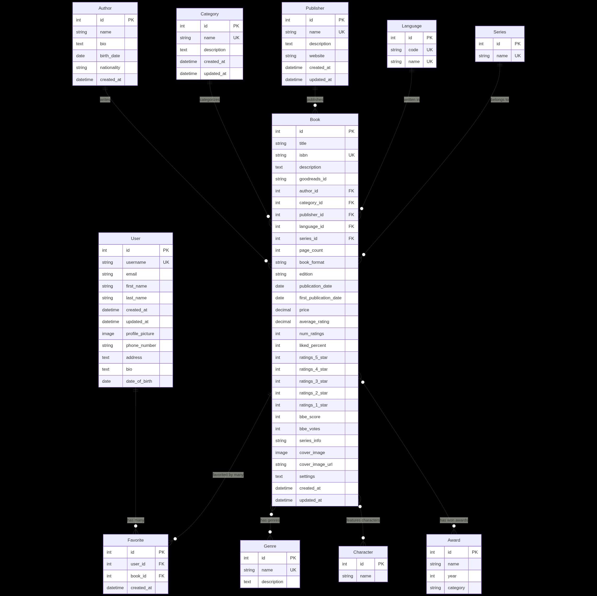
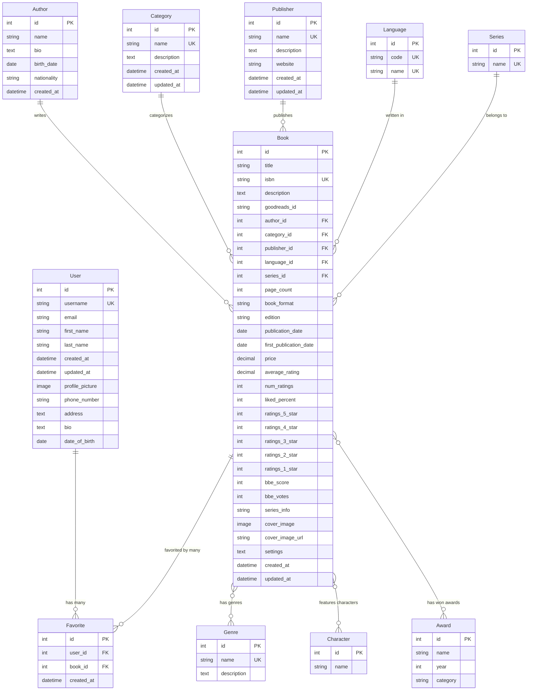

# Entity Relationship Diagram

This file contains the Entity Relationship (ER) diagram for the Django Bookstore database schema.

## 📊 Database ER Diagram

### Visual ER Diagram


### Interactive Mermaid Diagram


## 🔗 Relationship Legend

### Relationship Types
- **||--o{** : One-to-Many (One entity can have many related entities)
- **}o--o{** : Many-to-Many (Many entities can relate to many other entities)

### Key Symbols
- **PK** : Primary Key
- **FK** : Foreign Key
- **UK** : Unique Key

## 📋 Entity Summary

| Entity | Purpose | Key Relationships |
|--------|---------|-------------------|
| **User** | User accounts and profiles | One-to-Many with Favorite |
| **Book** | Central book information | Many-to-One with Author, Category, Publisher, Language, Series<br>Many-to-Many with Genre, Character, Award<br>One-to-Many with Favorite |
| **Author** | Author information | One-to-Many with Book |
| **Category** | Book categorization | One-to-Many with Book |
| **Publisher** | Publishing companies | One-to-Many with Book |
| **Language** | Book languages | One-to-Many with Book |
| **Series** | Book series | One-to-Many with Book |
| **Genre** | Book genres | Many-to-Many with Book |
| **Character** | Book characters | Many-to-Many with Book |
| **Award** | Literary awards | Many-to-Many with Book |
| **Favorite** | User book preferences | Many-to-One with User and Book |

## 🎯 Key Design Principles

### Normalization
- **3NF Compliance**: Eliminates redundant data
- **Referential Integrity**: Maintains data consistency
- **Atomic Values**: Each field contains single values

### Scalability
- **Indexed Fields**: Optimized for common queries
- **Efficient Relationships**: Minimizes join complexity
- **Flexible Schema**: Supports future enhancements

### Data Integrity
- **Foreign Key Constraints**: Ensures referential integrity
- **Unique Constraints**: Prevents duplicate data
- **Validation Rules**: Enforces data quality

## 🔍 Query Examples

### Common Queries Based on ER Diagram

#### Find all books by an author
```sql
SELECT b.* FROM Book b 
JOIN Author a ON b.author_id = a.id 
WHERE a.name = 'Author Name';
```

#### Find all genres for a book
```sql
SELECT g.* FROM Genre g
JOIN Book_genres bg ON g.id = bg.genre_id
WHERE bg.book_id = 1;
```

#### Find user's favorite books
```sql
SELECT b.* FROM Book b
JOIN Favorite f ON b.id = f.book_id
WHERE f.user_id = 1;
```

#### Find books in a series
```sql
SELECT b.* FROM Book b
JOIN Series s ON b.series_id = s.id
WHERE s.name = 'Series Name';
```

## 📊 Database Statistics

### Estimated Record Counts
- **Books**: 10,000+ records
- **Authors**: 5,000+ records
- **Categories**: 50+ records
- **Publishers**: 1,000+ records
- **Genres**: 100+ records
- **Users**: 1,000+ records
- **Favorites**: 50,000+ records

### Storage Requirements
- **Books Table**: ~50MB (10,000 records)
- **Authors Table**: ~5MB (5,000 records)
- **Favorites Table**: ~10MB (50,000 records)
- **Total Estimated**: ~100MB base data

## 🛠️ Maintenance Considerations

### Regular Maintenance Tasks
- **Index Optimization**: Monitor and optimize indexes
- **Data Cleanup**: Remove orphaned records
- **Statistics Update**: Keep query statistics current
- **Backup Verification**: Ensure backup integrity

### Performance Monitoring
- **Query Performance**: Monitor slow queries
- **Index Usage**: Track index effectiveness
- **Connection Pooling**: Monitor database connections
- **Storage Growth**: Track database size growth

---

*This ER diagram represents the current database schema for the Django Bookstore application. For detailed model information, see the [Database Schema Documentation](database.md).*
